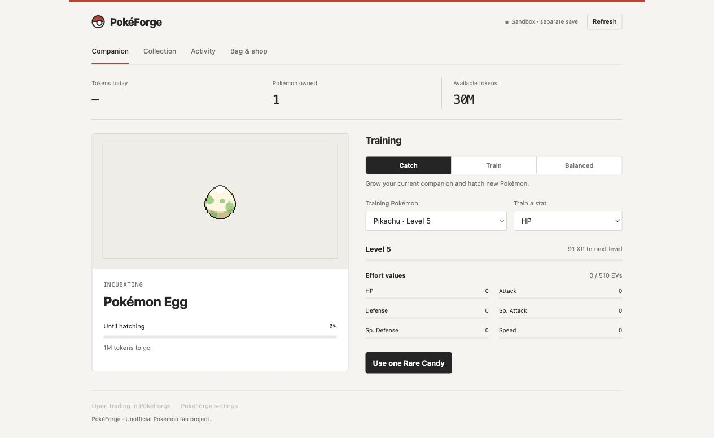
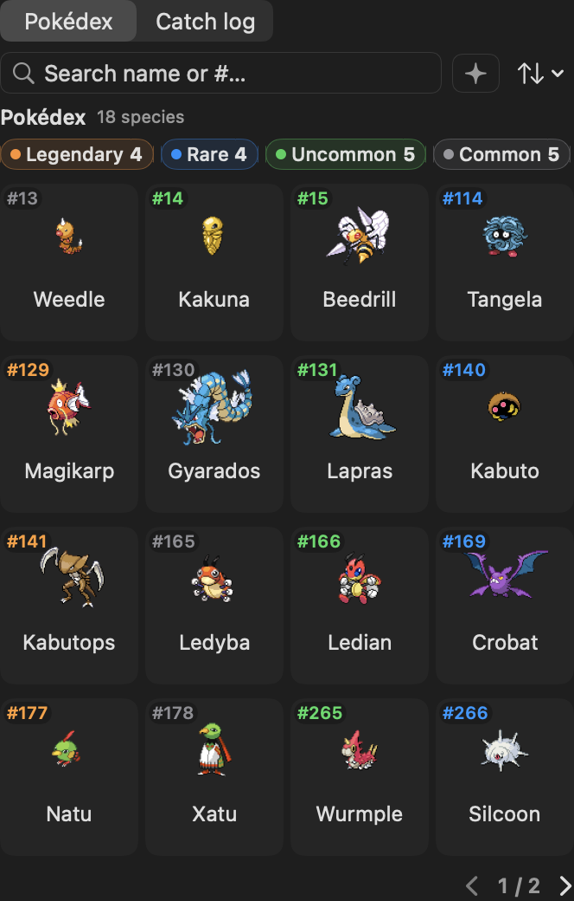

# PokéForge

**AI コーディングをポケモンの成長に変える。**

普段使っているコーディングツールのトークンを読み取り、macOS のメニューバーで相棒を育てながら、作業と一緒にコレクションを増やします。

[英語 README（正規版）](README.md) · [リリース](https://github.com/sacrezm/pokeforge/releases) · [ソース](https://github.com/sacrezm/pokeforge) · [貢献ガイド](CONTRIBUTING.ja.md)

> **フォークの出典:** PokéForge は [chattymin/PokeTokenBar](https://github.com/chattymin/PokeTokenBar) の独立したメンテナンスフォークです。元プロジェクトの MIT 著作権表示は [LICENSE](LICENSE) に残り、このフォークは [sacrezm/pokeforge](https://github.com/sacrezm/pokeforge) で管理されています。

## 現在使える機能

- **Codex プラグイン:** 既存の PokéForge セーブを共有し、Codex 内で相棒、トレーニング、コレクション、使用量、バッグとショップを開けます。[インストール手順](plugins/pokeforge/README.md)。 メニューバーアプリなしで単独動作し、同梱エンジンが既存のセーブを利用します。
- **トレーニング:** レベル 5–100、XP、EV、Catch / Train / Balanced モードに対応します。
- **使用量トラッキング:** Claude Code、Codex、Gemini CLI、Antigravity、OpenCode、Hermes Agent、Cursor、Grok CLI、Copilot CLI、Kiro CLI、Pi Agent、omp のローカル使用量を読み取ります。今日・週・月の合計と、対応する公式上限を表示します。
- **孵化と進化:** コーディングの使用量でタマゴを孵化させ、実際の進化系統に沿って相棒を育て、完成したポケモンをコレクションへ卒業させます。孵化にはレア度・せいかく・色違いがあります。
- **ショップ:** 使ったトークンをふしぎなアメ、ミント、光るお守り、新しいタマゴ、アンコモン・レア保証タマゴに使えます。
- **コレクション:** 現在の所有ポケモン、種単位の図鑑、個体ごとの捕獲ログを確認できます。フローティングペットとメニューバーの代表ポケモンも選べます。
- **交換:** トレーナーを作り、フレンドコードで友達を追加し、共有リレーを通じて卒業済みポケモンを1体交換します。双方が確認し、元のトレーナー情報は保持されます。タマゴと育成中の相棒は交換できません。

## 今後の予定

レベル、XP・EV、トレーニングモードと捕獲ボールは今回のリリースに含まれます。トレーナーバトルと探索は今後の予定です。

## スクリーンショット

分離されたサンドボックスデータを使った現在の Codex プラグインです。



以下は PokéForge の公開リブランド前のリリース UI です。一部の表記には元の名前が残っています。

<p align="center">
  
</p>

<p align="center">
  
  
</p>

## インストールと移行

[PokéForge のリリース](https://github.com/sacrezm/pokeforge/releases)からアプリ ZIP をダウンロードしてください。GitHub が自動生成するソースコード ZIP ではなく、ビルド済みアプリ ZIP を使い、展開したアプリを `/Applications` に移動します。

`PokeForge-v<VERSION>.zip` には macOS 14 以降、Apple Silicon・Intel 対応の `PokeForge.app` が含まれます。Codex プラグインには Node.js 24 以降が必要で、専用のプラグイン ZIP も提供します。

v2.6.3 を含む、PokéForge 前のすべてのビルドは、旧 `sacrezm/PokeTokenBar` の完全一致する `html_url` だけを受け入れます。GitHub の名称変更によるリダイレクトは新しい canonical URL を返すため、旧ビルドはリリースを検出できません。**最初の PokéForge リリースは1回だけ手動でインストールしてください。**

1. 古い PokeTokenBar で **ログイン時に開く** をオフにします。
2. PokeTokenBar を正常終了します。
3. 最初の `PokeForge-vX.Y.Z.zip` をダウンロードし、`PokeForge.app` を `/Applications` に置いて開きます。
4. コレクション・トレーナープロフィール・設定を確認してから、新しいアプリで **ログイン時に開く** を再度オンにします。
5. 確認後に古いアプリを削除します。Application Support、設定、Keychain のデータを消すアプリクリーナーは使わないでください。

完全な互換性情報は [identity と移行のメモ](docs/reference/pokeforge-identity.md) と [英語 README](README.md) を参照してください。

## ソースからビルド

macOS 14 以降、Swift 6 / Xcode 16 が必要です。

```bash
swift build
swift test

# build/PokeForge.app を作成し、インストールしない
PTB_INSTALL=0 ./scripts/build-app.sh

# build/PokeForge.app を作成して /Applications にインストール
./scripts/build-app.sh
```

`PTB_INSTALL=0` は `build/PokeForge.app` を作成するだけです。引数なしで実行すると、起動中の PokéForge を終了して `/Applications/PokeForge.app` を置き換えます。

## ブランド変更と互換性

公開名は PokéForge ですが、既存データと認証情報のため次の名前は維持されます。

- Swift の製品名は `PokeForge`。Swift target/module とソースパスは `PokeTokenBar`、`Sources/PokeTokenBar` のままです。
- ポケモン、交換状態、キャッシュは `~/Library/Application Support/PokeTokenBar/` に残ります。
- 既存の Keychain サービスと bundle identifier `io.github.chattymin.poketokenbar` を維持します。

## プライバシーと交換

使用量集計は AI ツールのローカルログ・データベースを読み取ります。使用量ログ、プロンプト、プロジェクトパスを交換リレーへ送信しません。公式上限・アカウント使用量とアップデート確認には一部ネットワーク通信があります。

ポケモンの種・進化データとスプライトは実行時に取得してローカルにキャッシュし、アプリとリリース ZIP にポケモンのアセットを含めません。

交換は任意のリレー機能です。リレーにはトレーナープロフィール、フレンドコード、公開鍵、フレンド関係と交換メタデータが届きます。ポケモンのオファー内容はこの Mac 上で暗号化されますが、リレーから見えるメタデータは保存される可能性があります。交換の秘密鍵と bearer 認証情報は macOS Keychain に保存されます。信頼できるリレーだけを使ってください。

## ライセンスと免責

[MIT License](LICENSE) はプロジェクトのソースコードに適用され、元プロジェクトの `chattymin` 著作権表示を保持します。ポケモンの商標・アートワーク・スプライト・データの権利を付与するものではありません。

PokéForge は非公式・非商用のファンプロジェクトであり、任天堂、ゲームフリーク、クリーチャーズ、株式会社ポケモンとは提携・推奨・後援・承認関係にありません。ポケモンのデータとスプライトは [PokéAPI](https://pokeapi.co/) から実行時に取得され、それぞれの権利者に帰属します。

貢献する前に [CONTRIBUTING.ja.md](CONTRIBUTING.ja.md) を読んでください。
